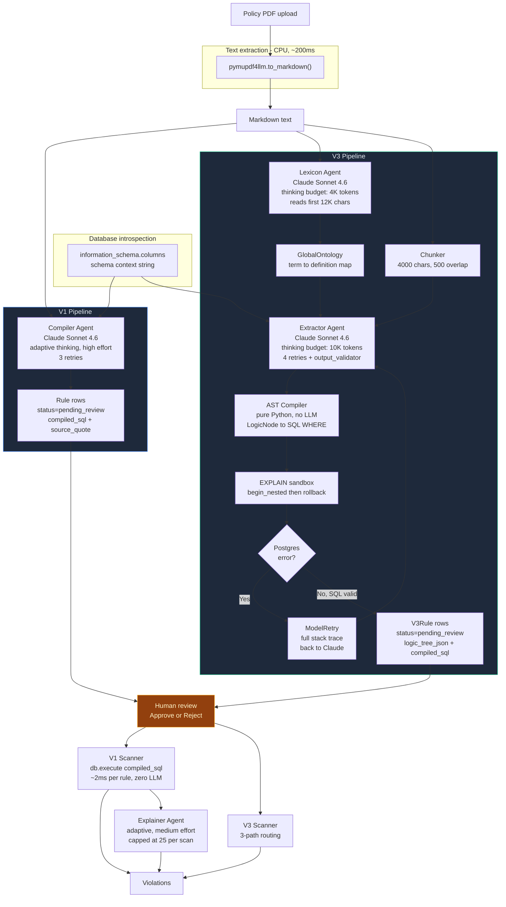
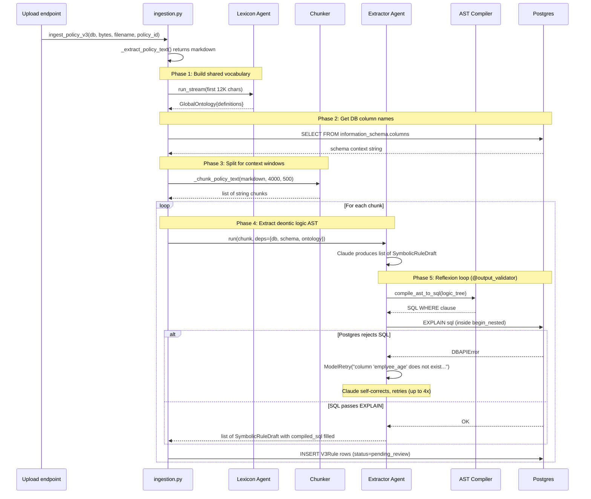
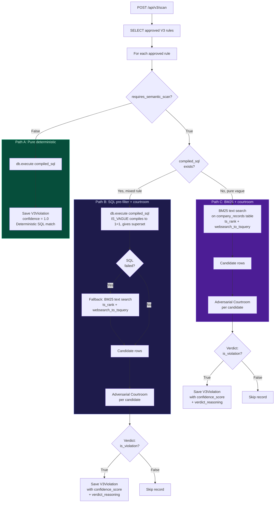
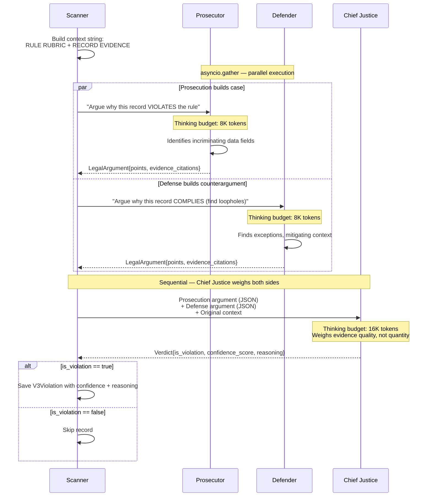
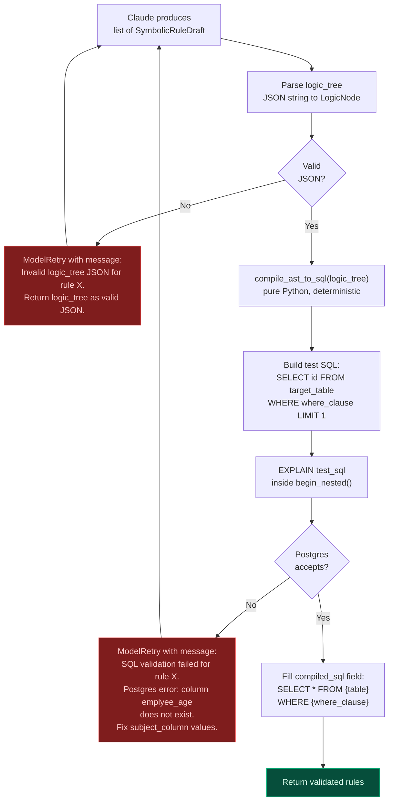
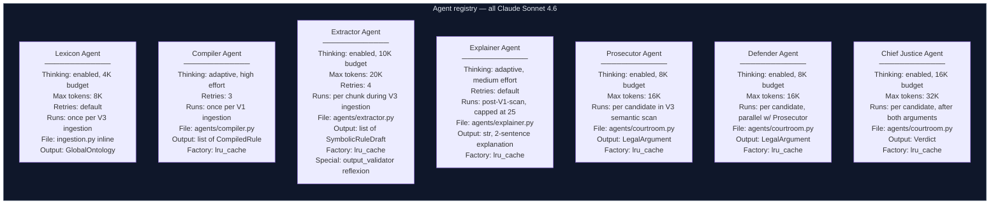
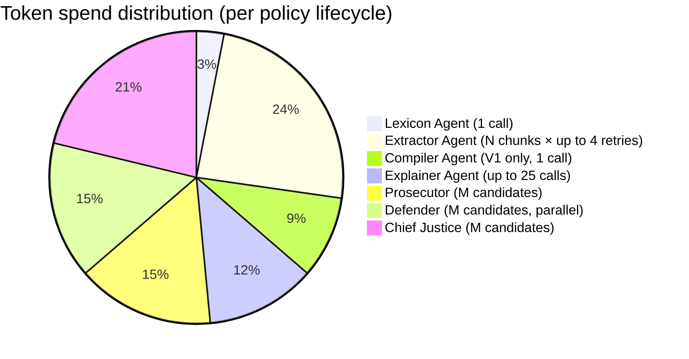
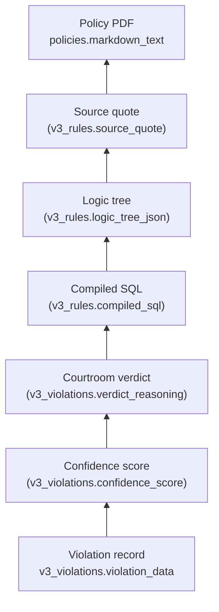

# How TraceRule's agents process policy documents

Seven Claude agents, two pipelines, one goal: turn legal text into enforceable database queries. No agent talks to another directly. The service layer passes typed Pydantic schemas between them.

---

## 1. Full system overview

---

## 2. V3 ingestion: from PDF to validated logic trees

This is the sequence of agent invocations during a single `POST /api/v3/policies/upload`. The Lexicon Agent runs first and its output feeds every subsequent Extractor call.

---

## 3. V3 scanner: three-path routing

After human approval, each V3 rule takes one of three scan paths based on whether its logic tree contains `IS_VAGUE` conditions.

---

## 4. Adversarial courtroom: the only parallel agent execution

Prosecutor and Defender run concurrently via `asyncio.gather`. The Chief Justice waits for both arguments before rendering a verdict.

---

## 5. Data contracts between agents

No agent calls another. The service layer moves typed Pydantic models between them. Every boundary is validated.

```mermaid
flowchart LR
    subgraph INGESTION["Ingestion phase"]
        direction TB
        LEX["Lexicon Agent"] -->|"GlobalOntology<br/>definitions: dict"| EXT["Extractor Agent"]
        EXT -->|"list of SymbolicRuleDraft<br/>logic_tree, target_table"| AST["AST Compiler"]
        AST -->|"SQL WHERE clause string"| VAL["output_validator"]
        VAL -->|"ModelRetry with postgres_error"| EXT
        VAL -->|"SymbolicRuleDraft<br/>with compiled_sql filled"| DB1[("V3Rule<br/>in database")]
    end

    subgraph SCAN["Scan phase"]
        direction TB
        SCANNER["Scanner"] -->|"dict record_data<br/>+ str rubric"| PROS["Prosecutor"]
        SCANNER -->|"dict record_data<br/>+ str rubric"| DEF["Defender"]
        PROS -->|"LegalArgument<br/>points, citations"| CJ["Chief Justice"]
        DEF -->|"LegalArgument<br/>points, citations"| CJ
        CJ -->|"Verdict<br/>is_violation, confidence, reasoning"| DB2[("V3Violation<br/>in database")]
    end

    DB1 -.->|"approved rules"| SCANNER

    style INGESTION fill:#0f172a,stroke:#3b82f6,color:#e2e8f0
    style SCAN fill:#0f172a,stroke:#ef4444,color:#e2e8f0
```

---

## 6. The reflexion loop in detail

The Extractor Agent's `@output_validator` is the only self-healing mechanism in the system. It turns Postgres error messages into correction prompts.

---

## 7. Agent registry

All seven agents, their configurations, and when they fire.

---

## 8. Token cost by phase

Deterministic scanning costs zero tokens. The courtroom is the expensive part, and it only fires for rules containing `IS_VAGUE` conditions. The `semantic_candidate_limit_per_rule` setting caps how many records enter the courtroom per rule.

---

## 9. Audit trail chain

Every violation traces back to the original PDF, through every intermediate representation.

For V1 violations, the chain is shorter: `violation → rule.compiled_sql → rule.source_quote → policies.markdown_text → ai_explanation`.

---

## Design rationale (short form)

**Why not one agent that does everything?**
Different phases have different cost profiles. The compiler needs `high` effort and schema context. The explainer needs `medium` effort and violation data. The courtroom needs adversarial structure. Cramming them into one agent wastes tokens and produces worse results.

**Why the adversarial courtroom instead of a single "is this a violation?" call?**
Single-agent evaluation anchors on its first interpretation and produces overconfident scores. The Defender forces the system to consider reasonable doubt. The Chief Justice, having seen both sides, produces calibrated confidence rather than binary yes/no.

**Why IS_VAGUE compiles to 1=1?**
V1 skipped subjective clauses entirely. V3 compiles them to `1=1` (match all rows), producing a superset that the courtroom narrows. No policy clause goes unenforced.

**Why BM25 instead of embeddings?**
Embedding tabular business data (expenses, transactions) produces garbage similarity scores. "Is this gift lavish?" and `{amount: 50000, category: "entertainment"}` don't embed into useful proximity. Postgres-native `ts_rank` retrieves candidates. The courtroom handles semantic evaluation.

**Why the @output_validator reflexion loop?**
Claude sometimes generates ASTs referencing nonexistent columns. The loop runs `EXPLAIN` on the generated SQL, catches Postgres errors, and feeds the exact error message back. Claude sees "column 'emplyee_age' does not exist" and fixes it. SQL that survives EXPLAIN is guaranteed executable at scan time.
